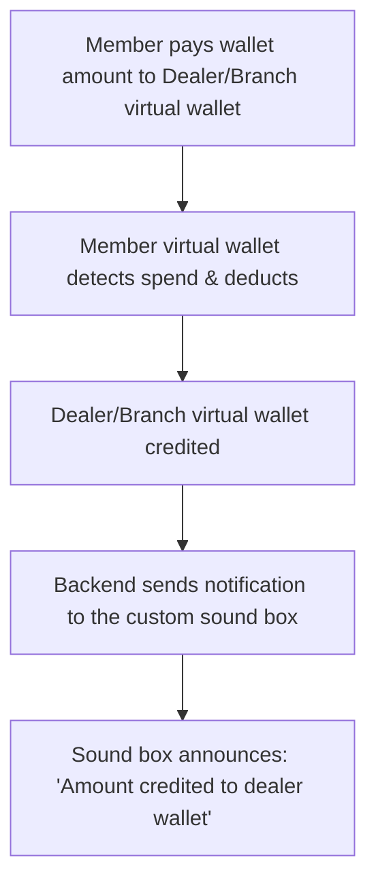

# Lord ICL Web‑View App → React Native + API: Investigation Report

> Source of investigation: legacy CodeIgniter 3 app at `c:\wamp64\www\lordicl` (served at `localhost/lordicl/app`).
> Prepared 2026-06-13. This is the reference brief for rebuilding the mobile app in **React Native** consuming a clean **API**.
>
> **Note:** the legacy app already has rebuild docs under `c:\wamp64\www\lordicl\docs\` (`REBUILD_DATAMODEL_API.md`, `SYSTEM_MAP.md`, `MVC_ANALYSIS.md`, `SRS.md`, `schema_lordicl.sql`) — diff this report against them.
> **Key strategic point:** `lordicl-next` (this Laravel/Filament project) is already the admin rebuild and contains the domain engine — it is the natural home for the new API (see §10).

---

## 1. What it is & where it lives
- **Stack:** CodeIgniter 3 (PHP), MySQL `lordicl` (131 tables, ~7.3k members, ~11k bonds, ~189k commission rows).
- **The web-view app** = the `app` module. Route `app` → `app/home` (`controllers/app/…`). It's a thin mobile skin over the same DB the website and admin use.
- **Three entry points** in `config/routes.php`: `home` (public site), `member` → `member/auth` (distributor portal), `admin` → `admin/auth` (back office). The Android app wrapped the `app` + `app/member` URLs in a WebView.

## 2. The "API" reality today — there isn't one
- **No REST API exists.** No `Api`/`Rest` controllers, no `/api/v1`, no JWT.
- Communication is **form POST → page reload**, or **AJAX → HTML fragment / bare integer / "ok"/"pass" strings**. ~23 controllers use `json_encode`, but mostly for lookups, not a real contract.
- **Implication:** for React Native you are building the API from scratch. Nothing to "just consume." The legacy AJAX endpoints are only useful as a *feature/behavior reference*.

## 3. Auth & session model (today)
- **Phone-based OTP** is primary (4-digit), delivered via **SMS (msg91 / Fast2SMS)** and **WhatsApp (Interakt)**; OTPs tracked in `tbl_otp_logs`.
- Server-side PHP sessions; keys: `admin_id`, `adminname`, `refname`, `is_member_login`, `org_phone`, `mode`.
- **`mode`** = `customer | user(distributor) | dual | btob` — one phone can be both a retail customer and a distributor (`dual`). Core concept to preserve.
- "Remember me" via a persistent `parry_ph` cookie. Passwords bcrypt-hashed (but a 5-char plaintext copy is also stored — a flaw to drop).
- **For the new app:** replace with **token auth (Sanctum/JWT) + OTP**, keep the dual-profile concept.

## 4. Customer app feature set (`controllers/app/`)
- **Auth/registration:** phone+OTP, dual-mode, language (EN/TA/HI), auto-login cookie.
- **Catalog:** Gold/Silver categories → subcategory → product detail w/ image gallery; **live rate ticker** (`tbl_liverate`); server-side price = `rate×weight + making% + wastage% + GST`.
- **Cart & checkout:** CI cart (session), address w/ pincode lookup (external API), **PhonePe/Billdesk** payment, result page.
- **Digi-gold:** buy by grams or amount, live price, checkout.
- **Orders & profile:** order list/detail, transaction history, profile + photo upload, notifications.
- **B2B:** separate OTP login, package calculator, pre-registration + payment, dashboard.
- **Info/static:** about, why-us, vision, events, FAQ, support, video guide, store locator (Google Maps), legal/policies, plan guide.

## 5. Distributor/member feature set (`controllers/member/` + `app/member/`)
- **Dashboard:** BV/GBV, earnings, downline counts.
- **Genealogy/downline:** binary (left/right) **and** level trees; add downline with full KYC + nominee + bank; live validation endpoints (aadhaar/PAN/phone/upline/epin); plan + position selection. *Live data shows only the **Level/GAP** model is active; binary is vestigial.*
- **Earnings/commissions:** IC (instant), GAP/level, CBC (cashback coupons), pair-match, ROI, referral, bill-margin, silver coupon, rewards.
- **Wallet/EPIN/vouchers:** balance, incoming/outgoing, withdraw (cash & **digi-gold via QR**), transfer to member; create/consume EPINs; voucher tracking.
- **Orders/receipts:** my plans/bonds, invoices, RD receipts, MOU/contracts (PDF print).
- **Profile/settings:** edit profile, bank (with Razorpay IFSC lookup), language, photo (base64 + multipart), KYC status.
- **Reports/exports:** wallet, digi-gold buy/sell, EPIN history, level targets, CSV exports.

## 6. Data & settlement reality (what the schema alone won't tell you)
- **Payout rail is digi-gold, not cash.** IC commissions settle ~**90% via DIGI TRANSFER**; the cash wallet table is effectively dead (1 row ever).
- **Money-in is ~95% manual "cashmode"** (offline collection) on both retail invoices and online orders. Payment gateways are ~5% edge case.
- **Only 5 ranks** are actually used (MEMBER, TALUK, DISTRICT, ZONAL, STATE) of 13 defined.
- Key tables: `tbl_member`, `tbl_bond`, `tbl_plan(jewel)`, `tbl_iccom`, `tbl_memberearning_level` (GAP), `tbl_cbc`, `tbl_gap_log`, `tbl_order_digiunique`, `tbl_digi_queue`, `tbl_digiwithdrawal`, `tbl_salesinvoice`, `tbl_rdentry`.

## 7. Integrations to re-home
- **Payments:** PhonePe/Billdesk (active), Airpay/Razorpay (referenced). Razorpay IFSC lookup (active).
- **Messaging:** msg91 / Fast2SMS (SMS), Interakt (WhatsApp), Firebase FCM (push).
- **Docs:** TCPDF/mPDF (invoices/contracts), multiple QR libraries.
- ⚠️ Several **API keys/secrets are hardcoded** in controllers and in `tbl_paymentgw`/`tbl_whatsappapi`. They must be rotated and moved to env on the rebuild. (Not reproduced here on purpose.)

## 8. Landmines in the legacy code (don't port these)
- Pervasive **SQL injection** (string-interpolated queries), **CSRF disabled**, empty encryption key.
- **Cron/batch scripts (`Ascript`, `Lscript`, etc.) are publicly web-routable with no auth** and run BV/rank/commission recalcs synchronously — a serious hole. Must become CLI/queued jobs.
- **Money stored as VARCHAR**; mixed MyISAM/InnoDB engines (no rollback on the MyISAM payout tables); heavy denormalization (upline name copied across rows).
- Duplicate parallel systems (`tbl_product` vs `tbl_qfproduct`, two god-models).

## 9. Proposed REST API surface (v1) for the React Native app
- **Auth:** `POST /auth/otp/request`, `POST /auth/otp/verify` → token, `POST /auth/logout`, profile-switch for dual accounts.
- **Catalog/shop:** `GET /rates`, `GET /products`, `GET /products/{id}`, `POST /cart/items`, `POST /checkout` (manual-collection first, gateway opt-in), `GET /orders`.
- **Digi-gold:** buy, holdings, `POST /digi/withdraw`, QR redemption (branch).
- **Member:** `GET /member/dashboard`, `GET /member/genealogy`, `POST /member/downline` (the big transactional sponsor+purchase+bond+IC/CBC flow), `GET /member/earnings/{type}`, `GET /member/wallets`, `POST /member/wallets/{type}/withdraw`.
- **Profile/KYC:** get/update profile, bank (IFSC lookup), photo, verification.

## 10. Strategic recommendation — build the API on `lordicl-next`, not CI3
**`lordicl-next` (this Laravel/Filament project) already contains the rebuilt domain engine**: plans, bonds, `SalesService`, `RedemptionService`, commission approval, multi-currency, branches, stock, live rates. The legacy CI3 app is the **feature spec**; Laravel is the **natural API home** because:
- The business logic you'd expose is already written and tested here (101 tests).
- You avoid reviving an insecure CI3 codebase.
- Laravel Sanctum gives token auth for React Native out of the box.
- One source of truth: admin (Filament) and the mobile API share the same models/services.

**Target shape:** React Native ↔ Laravel API (in `lordicl-next`, `routes/api.php` + Sanctum) ↔ existing services. CI3 app used only to copy screen-by-screen behavior; the `lordicl` DB used for data migration.

## 11. What already exists to leverage
- `c:\wamp64\www\lordicl\docs\REBUILD_DATAMODEL_API.md` — drafted target schema + REST surface.
- `c:\wamp64\www\lordicl\docs\SYSTEM_MAP.md`, `MVC_ANALYSIS.md` — architecture + live-data audit.
- `c:\wamp64\www\lordicl\docs\SRS.md`, `schema_lordicl.sql` — requirements + full schema dump.
- (Not yet read line-by-line — diff against this report.)

## 12. Open questions to decide (scope)
1. **API home:** build on `lordicl-next` (Laravel/Sanctum) as recommended, or a separate API service?
2. **Scope of v1 app:** customer shop only, distributor portal only, or both? (Very different apps.)
3. **Payments:** keep PhonePe primary, or — since 95% is manual cash — make manual collection first-class and gateway optional?
4. **Data:** migrate live `lordicl` data into `lordicl-next`, or start fresh and run in parallel?
5. **Messaging:** standardize on one SMS + one WhatsApp provider for the new app?

---

## Owner's vision (raw notes)
- The web-view (`localhost/lordicl/app`) understanding above is the *classic* baseline. The target is a **feature-rich super-app**, not a port.
- **Public users:** browse → add to cart → create account → checkout (e-commerce).
- **Members:** see earnings, downline, wallet, etc.
- **Social platform** to interact with *closed* (verified) members.
- **Zoom integration:** meetings already happen on Zoom — bring them inside the app.
- **Scan & pay (PhonePe-style):** scan a QR and pay from the **Digi-gold wallet**.
- **Offline/online sync:** store data on the device, work offline, sync up.
- **Data center:** cloud storage for members' files/documents.
- **Unified in-app message center:** Firebase in-app messaging + inbound WhatsApp messages in one inbox.
- **React Native** chosen to cover **Android + iOS** from one codebase.
- "Put some masala" → expert additions below.

---

# PART B — The Feature-Rich Super-App (target vision)

This reframes the project: not "rebuild the web-view," but **build the Lord ICL member super-app** — commerce + MLM + community + payments + comms — on a clean Laravel API, shipped to Android & iOS via React Native.

## B1. Product pillars
1. **Shop (public + members):** catalog, live rates, cart, checkout, orders, digi-gold buy. Open to the public; richer for logged-in members.
2. **My Business (members):** dashboard, genealogy/downline, earnings (IC/GAP/CBC/ROI/bill-margin), bonds/RD, KYC, reports.
3. **Wallet & Pay:** digi-gold wallet, **scan-and-pay**, transfers, withdrawals, transaction history, statements.
4. **Community (closed):** private social feed for verified members — posts, team channels, leaderboards, announcements, events.
5. **Live & Learn:** Zoom meetings/webinars in-app, recordings, training library, plan guides.
6. **Inbox:** one message center merging push (FCM), in-app campaigns, support chat, and inbound WhatsApp.
7. **Vault:** personal document center — bonds, invoices, contracts, KYC, receipts — stored in the cloud, viewable offline.

## B2. Feature deep-dive + my "masala"

### Scan & Pay from the Digi-gold wallet (the standout feature)
- **Flow:** scan a branch/member QR → enter/confirm amount → amount is **price-locked to the live gold rate at scan time** → confirm with **PIN/biometric** → debit payer's gold wallet (grams), credit payee → instant receipt.
- **Masala — do it as a ledger, not a balance field:** double-entry `wallet_entries` (every debit has a matching credit), so balances are always derivable and auditable. This mirrors how `lordicl-next` already stamps money; reuse the multi-currency/`Money` discipline.
- **Masala — hold→capture + idempotency:** generate a payment intent with an `idempotency_key`; "hold" gold at scan, "capture" on confirm, auto-expire holds. Prevents double-spend and double-tap charges.
- **Masala — QR types:** dynamic (amount-embedded, single-use, signed + TTL) vs static (merchant-only, payer enters amount). Sign QRs (HMAC) so they can't be forged.
- **⚠️ Compliance flag (important):** a gold-backed wallet used to pay is a **stored-value / prepaid instrument**. Keep it **closed-loop** (spendable only inside the Lord ICL network) to stay lighter on RBI PPI rules; an open-loop (pay any merchant) wallet triggers heavy licensing. Get a fintech-compliance/legal review before launch. This is a business decision, not a code one.

### Dealer "Sound Box" — closed-loop merchant confirmation (member → dealer cash-out)
**Purpose:** the cash-out side of Scan-&-Pay. A (non-distributor) member pays a **Dealer/Branch virtual wallet** from their digi-gold wallet; the dealer's wallet is credited and the dealer hands over real money/goods. A custom **IoT sound box** at the dealer counter **audibly announces the credit** — exactly like the Paytm/PhonePe soundbox, but on **our own rails, no NPCI/UPI**.

**Owner's flow (kept):**


**Owner's BOM (kept):** ESP32 (Wi-Fi+BLE ₹500) · DFPlayer Mini (₹200) · 3W speaker (₹100) · 4G module SIM800L/SIM7000 (₹1500, if no Wi-Fi) · battery + charge circuit (₹300). Chosen module: **TTGO T-SIM7600G-H R2** (ESP32-WROVER + 4G LTE SIM7600 + GPS).

**Owner's firmware logic (kept):** boot → connect Wi-Fi/4G → register device ID with backend → hold a persistent connection (WebSocket or 2s poll) → on message ("credited ₹100") play pre-recorded/TTS audio.

**Owner's API (kept):** `POST /device/notify { device_id, message, amount }`.

#### My masala (engineering hardening)
- **Soundbox is an *announcer*, never the source of truth.** Money moves only in the wallet ledger (hold→capture, §Scan&Pay). The device just plays a confirmation tied to a committed `transaction_id`. If the box is offline/muted, the payment is still done.
- **Use MQTT, not raw WebSocket/polling.** For many battery devices on flaky 4G, an **MQTT broker** (EMQX / Mosquitto / HiveMQ) beats a custom WS server: tiny footprint, **QoS 1** guaranteed delivery, **retained** messages, **Last-Will** for instant offline detection, auto-reconnect. Each device subscribes to `soundbox/{device_id}`; backend **publishes** the credit event. (Polling every 2s × thousands of devices will hammer your server and drain batteries — avoid.)
- **`/device/notify` is internal, not public.** Reframe: the dealer-credit event → backend publishes to the device topic. If you keep an HTTP endpoint, it must be **server-to-broker only**; a public notify endpoint = anyone can trigger fake "credited" announcements. **Each device authenticates** with a provisioned **device token/secret over TLS**; reject unknown/forged device IDs.
- **Idempotent + ACK.** Payload carries `transaction_id`; the device **dedupes** so a reconnect/redelivery doesn't double-announce. Device sends an **ACK** back → backend marks "announced" and the dealer app shows a delivery tick. Unacked after N seconds → retry / fall back to the dealer's phone push (FCM) so confirmation never silently fails.
- **Audio = pre-recorded fragments, not live TTS.** DFPlayer plays indexed MP3s offline. Indian soundboxes **concatenate fragments** ("Lord ICL" + "received" + "one" + "hundred" + "rupees") rather than synthesize. Ship fragment packs per **language (Tamil/Hindi/English)**; backend sends a **structured payload** (`amount`, `lang`, `txn_id`) and the device composes locally — instant, multilingual, no network round-trip for speech, far cheaper than TTS.
- **Power reality (SIM7600):** the 4G modem draws **~2A bursts** on transmit; under-powered supplies cause random reboots. Spec a proper Li-ion + a big bulk capacitor near the modem. Provision Wi-Fi creds over **BLE** (a setup screen in the dealer app) so there's no hardcoded SSID.
- **Pairing:** bind `device_id ↔ branch/dealer wallet` by **scanning the device QR in the dealer app** (one dealer can own several boxes). Store in a `devices` table.
- **Backend pieces (in `lordicl-next`):** `devices` (device_id, secret_hash, branch_id, status, last_seen_at, firmware_ver, lang), `device_events` (audit log of every announce + ack), an **MQTT publish** on wallet-credit, a Filament screen showing **online/offline (via Last-Will), last announcement, battery/signal**, and OTA-style firmware version tracking.
- **Reconciliation & cash-out semantics:** a dealer accumulating member payments is effectively a **cash-out agent** — the dealer's wallet credit later settles to real money via the existing payout/redemption rail (ties into the redemption→restock work already built). Keep an audit trail per dealer; **KYC/AML applies to cash-out**. Flag for the same compliance review as the wallet.
- **Event schema (suggested):**
  ```json
  // backend → broker → device  (topic: soundbox/{device_id}, QoS 1)
  { "type": "credit", "txn_id": "WX9F...", "amount": 100, "currency": "INR",
    "lang": "ta", "dealer": "Trichy-Aishwaryam", "ts": 1718200000 }
  // device → backend (ACK)
  { "type": "ack", "device_id": "SNDBX_001", "txn_id": "WX9F...", "played": true }
  ```

### Community / social platform (closed members)
- **Feed:** posts (text/image/video), reactions, comments; **team channels** auto-scoped by genealogy (your upline/downline group); company-wide announcements; **rank-promotion celebrations** and **leaderboards** (top earners/recruiters) — these are huge motivators in MLM.
- **Masala — realtime:** use **Laravel Reverb** (built-in WebSockets) or Pusher for live comments/notifications; fan-out via an activity-feed table.
- **Masala — gating & moderation:** only **verified** members post; report/block, profanity filter, admin moderation queue in Filament. Plan for it early — social without moderation goes bad fast.
- **Masala:** start with a **read-mostly announcement + team feed** in v1, expand to full social later. Don't build a full Instagram on day one.

### Zoom integration
- **Masala — two tiers:**
  - *Lightweight (fast):* server creates meetings via **Zoom Server-to-Server OAuth API**, stores schedule, sends reminders, and the app **deep-links** to the Zoom app to join. Cheapest, ships fast.
  - *Embedded (premium):* **Zoom Meeting SDK** (React Native bridge) for in-app join + branding. Heavier, needs native build.
- Gate meetings by **rank/membership**; track attendance; surface recordings in "Live & Learn." Recommend starting lightweight, upgrading to SDK if the in-app feel is worth it.

### Offline / online sync (local-first)
- **Masala — tier the data by trust:**
  - *Cacheable offline (read):* catalog, live rate (last known + "stale" badge), my earnings/genealogy/bonds, documents → store locally, show instantly, refresh on connect.
  - *Queued offline (write, non-financial):* profile edits, cart, draft downline forms → queue and replay with conflict handling.
  - *Never authoritative offline (financial):* payments, withdrawals, commission-generating actions → **server is the source of truth**; offline only *drafts* an intent that the server validates on sync.
- **Masala — engine:** **WatermelonDB** (or SQLite via `op-sqlite` + Drizzle) for the local store; sync via `updated_at` + soft-delete tombstones (pull changed, push queued). Conflict policy: **server-wins for money**, last-write-wins for drafts.

### Data center / file vault
- **Masala:** object storage — **S3 / DigitalOcean Spaces / self-hosted MinIO** — with **presigned upload/download URLs** (files never proxy through the API), a CDN in front, per-member folders, **encryption at rest**, and a retention policy. Surface it as a **personal vault**: auto-files their bonds/invoices/contracts/KYC, plus their own uploads. Offline cache the recently-viewed ones.

### Unified inbox / message center
- **Masala — one `messages` table, many sources:** `system` (FCM push), `campaign` (Firebase In-App Messaging), `support` (two-way chat), `whatsapp` (inbound). Inbound WhatsApp arrives via **Interakt webhook → your Laravel API → stored → realtime to app**; replies go back out through the WhatsApp Business API. Unified read/unread, deep-links into the relevant screen.
- **Masala:** FCM **data messages** for silent sync triggers (e.g., "new commission posted, refresh"), not just visible notifications.

## B3. Recommended architecture & stack

**Backend (in `lordicl-next`, Laravel):**
- **Modular monolith** — keep one Laravel app, organized by module (Shop, Member, Wallet, Community, Comms, Files). Don't split into microservices yet; you don't have the scale or the ops team for it. Carve out later if needed.
- **API:** versioned `routes/api.php` (`/api/v1`), **Sanctum** personal-access tokens + OTP login, `JsonResource` response shapes, `FormRequest` validation.
- **Realtime:** Laravel **Reverb** (WebSockets) for feed/inbox/notifications.
- **IoT / sound box:** an **MQTT broker** (EMQX/Mosquitto) for the dealer sound boxes — device auth via per-device token over TLS, topic `soundbox/{device_id}`, QoS 1 + Last-Will. Wallet-credit → backend publishes the announce event.
- **Async:** queues (Redis) for commission runs, notifications, PDF generation, WhatsApp send, sync fan-out, device publishes. Move the legacy "cron via public URL" scripts to **scheduled queued jobs**.
- **Files:** S3-compatible storage + presigned URLs.
- **Push:** FCM (Android + iOS via APNs through FCM).

**Mobile (React Native):**
- **Expo (SDK 50+) with Dev Client + EAS Build** — gives OTA updates, easy iOS/Android builds, config plugins for native modules (Zoom, biometrics, payments). Drop to bare RN only if a native SDK demands it.
- **TypeScript**, **TanStack Query** (server cache/offline), **Zustand** (UI state), **WatermelonDB** (local-first), **Reanimated/Gesture Handler** (smooth UI), **react-navigation**.
- **Security:** biometric/PIN app-lock, **certificate pinning**, **encrypted local DB**, device binding for the wallet, secure storage for tokens (Keychain/Keystore).
- **Quality:** **Sentry** (crash), analytics, feature flags, EAS OTA for hotfixes.

**Shape:**
```
React Native (Expo)  ──HTTPS/JSON──▶  Laravel API (lordicl-next)
   • local SQLite (WatermelonDB)         • Sanctum + OTP
   • TanStack Query cache                • domain services (Sales/Redemption/Commission/Money) ← already built & tested
   • offline queue                       • queues (Redis) · Reverb (WS) · S3 files · FCM push
       ▲  WebSocket (Reverb)  ▲  presigned S3  ▲  FCM
External: PhonePe · WhatsApp(Interakt) · Zoom · SMS
```

## B4. Why this fits what you already have
`lordicl-next` already holds the hard parts — plans, bonds, sales, **redemption + QR**, commission settlement, **digi-gold/wallet stamping**, multi-currency, branches, stock, live rates, 100+ passing tests. The super-app's API is largely **exposing services that exist**, plus new modules for Community, Comms, Files, and Scan-Pay. That's a strong head start.

## B5. Revised phased roadmap (super-app)
- **Phase 0 — API foundation:** Sanctum+OTP auth, user/profile/KYC, response shapes, error contract, FCM wiring. *(in `lordicl-next`)*
- **Phase 1 — Shop:** catalog, live rates, cart, checkout (manual-collection first + gateway), orders. Public + member.
- **Phase 2 — My Business:** dashboard, genealogy, earnings, bonds/RD, reports, vault (documents).
- **Phase 3 — Wallet & Scan-Pay:** digi-gold wallet ledger, QR scan-and-pay (hold/capture/idempotent), member→dealer P2M, transfers, withdrawals. *(compliance review gate)*
- **Phase 4 — Inbox & Comms:** unified message center, FCM push, support chat, inbound WhatsApp.
- **Phase 5 — Community:** announcements + team feed → reactions/comments → leaderboards. Realtime via Reverb.
- **Phase 6 — Live & Learn:** Zoom (deep-link first, SDK later), training library.
- **Phase 7 (LAST) — Dealer Sound Box:** `devices` registry + pairing, MQTT broker, publish-on-credit, ACK + offline (Last-Will) handling, multilingual audio fragments, Filament device dashboard. Firmware on TTGO T-SIM7600G-H. **Deferred to the end — the device is still being architected by engineering;** the app/API only needs the dealer-credit event (built in Phase 3), so the box can be added later without reworking the wallet.
- **Cross-cutting from Phase 1:** offline cache → offline queue, hardening, OTA.

## B6. Big decisions to lock before building
1. **Wallet compliance:** closed-loop (recommended) vs open-loop scan-pay, **plus dealer cash-out KYC/AML** — needs legal/fintech sign-off. **Blocking for Phase 3.**
1b. **Sound box transport:** MQTT broker (recommended) vs WebSocket vs polling; and **device provisioning/security** model (per-device token over TLS). Confirm before ordering hardware at scale.
2. **Expo vs bare RN** (recommend Expo + Dev Client unless Zoom SDK forces bare).
3. **Zoom tier:** deep-link (cheap, fast) vs embedded SDK (premium).
4. **Social scope for v1:** announcement/team feed only, or full social.
5. **Data migration:** lift live `lordicl` data into `lordicl-next` now, or run parallel and migrate per-module.
6. **One backend** (modular monolith in `lordicl-next`) — confirm, vs a separate API service.
7. **Provider consolidation:** one SMS + one WhatsApp + one push + one file-storage vendor.

## Your notes / decisions
<!-- Add your reactions to PART B, pick options in B6, and note anything to change. -->

-


